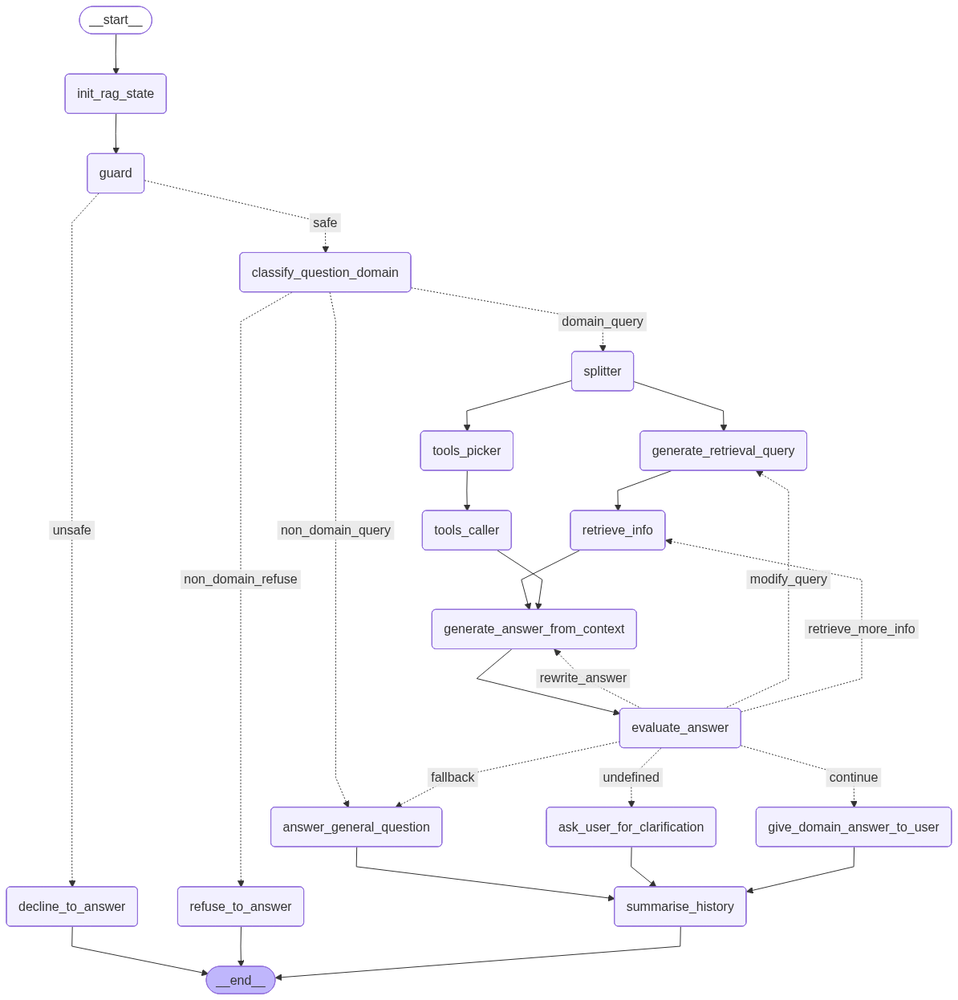

RAG
===

What is RAG?
------------

Retrieval Augmented Generation (RAG) is an AI framework that
retrieves facts from an external knowledge base to ground large
language models (LLMs) on the most accurate, up-to-date information
and to give users insight into LLMs' generative process [Wikipedia]_.

.. [Wikipedia] Retrieval-augmented generation - Wikipedia
   https://en.wikipedia.org/wiki/Retrieval-augmented_generation

In simpler terms: instead of asking the LLM to answer from its
(frozen, possibly outdated) training data alone, you first look up
relevant documents in your own vector store and hand them to the LLM
as context.  The LLM's answer is grounded in those documents, and the
source can be cited -- reducing hallucinations and making the process
transparent.

Why RAG over fine-tuning?
-------------------------

RAG has several advantages over fine-tuning (retraining) a model on
your data:

* **No training cost** -- no GPU needed, no training pipeline.
  RAG works with any LLM out of the box.
* **Incremental** -- add documents any time; no re-training needed.
* **Grounded answers** -- the LLM cites its sources.  Fine-tuned
  models can still hallucinate facts they were trained on.
* **Transparent** -- you control the corpus.  If an answer looks
  wrong, you can inspect the retrieved chunks.
* **Swap models freely** -- change the underlying LLM without
  rebuilding your knowledge base.

Fine-tuning still has its place (teaching a model an entirely new
skill or output format), but for open-ended question answering over a
document collection, RAG is the simpler and more maintainable choice.

Klea's architecture
-------------------

At a high level, a query flows through these stages:

1. **Guard** -- the ``llama-guard3`` model checks whether the query
   is safe and appropriate.  Unsafe queries are declined immediately.

2. **Classify** -- a chat model classifies the query into one of the
   configured *domains* (e.g. "NeuroML documentation"), or routes it
   to general chat, or refuses if no domain matches.

3. **Retrieval** -- the system generates one or more search queries,
   optionally calls MCP tools (for live data), and retrieves the most
   relevant chunks from the matching domain's vector stores.

4. **Answer** -- the chat model generates an answer from the
   retrieved context, citing its sources.

5. **Evaluate** -- an evaluator checks the answer's quality.  If it
   is unsatisfactory, the system can loop back to retrieve more
   information, rewrite the query, or regenerate the answer.

6. **Memory** -- conversation history is summarised per session so
   the system can refer to earlier exchanges.

The pipeline is implemented as a `LangGraph
<https://langchain-ai.github.io/langgraph/>`_ state machine, using
the shared :class:`~klea_utils.graph.base.BaseLangGraph`
orchestrator from ``klea_utils``.

   The RAG pipeline visualised as a LangGraph state machine.

Domains and vector stores
-------------------------

Domains are the organising unit of Klea RAG:

* A **domain** bundles related knowledge and configuration
  (e.g. "NeuroML documentation", "My project's internal docs").
* Each domain has one or more **vector stores** containing the
  embedded chunks.
* The classifier uses the domain's *description* to decide where a
  query should go.
* Domains can also have **MCP servers** attached, giving the LLM
  access to live tools (e.g. a validation server, a database query
  tool).

This means one RAG server can simultaneously serve completely
different knowledge areas -- the classifier routes queries to the
right domain automatically.

.. seealso::

   * :doc:`../glossary` -- definitions of key terms
   * :doc:`../tutorials/create-and-use-rag` -- walk through setting up a
     RAG system end to end
   * :doc:`../cli/klea-rag-serve` -- server CLI reference
   * :doc:`../cli/klea-rag` -- client CLI reference
