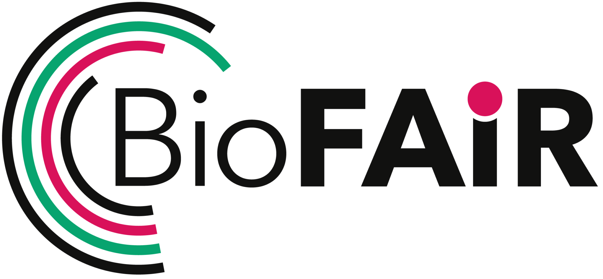

Welcome to Klea
===============

Knowledge vaLidated Expert AI Assistant for Neuroscience.

Klea is a suite of AI tools for Neuroscience.  It provides a generic
RAG pipeline, an AI-assisted coding workflow system, and MCP servers
for modelling and analysis.

Architecture
------------

The project is organised as a monorepo with four installable packages:

.. list-table::
   :header-rows: 1

   * - Directory
     - Package
     - CLI
     - Purpose
   * - ``utils_pkg``
     - ``klea_utils``
     - ``klea-vs-create``
     - Shared utilities, vector store management, base graph classes
   * - ``rag_pkg``
     - ``klea_rag``
     - ``klea-rag``, ``klea-rag-serve``
     - Generic RAG pipeline with multi-domain support
   * - ``code_pkg``
     - ``klea_code``
     - ``klea-code``
     - AI-assisted coding and workflow system
   * - ``mcp_pkg``
     - ``neuroml_mcp``
     - ``nml-mcp``
     - MCP server for NeuroML tooling

Each package is built on a shared foundation in ``klea_utils``, which
provides LLM setup, vector store abstraction, and the
:class:`~klea_utils.graph.base.BaseLangGraph` orchestrator framework.

Funding
-------

Klea is funded by the `BioFAIR <https://biofair.uk/>`_ Pathfinder
Projects grant `"Creating AI-enabled analysis pipelines for FAIR
neuroscience data"
<https://biofair.uk/updates/2026/biofair-pathfinder-projects-launch-with-800k-to-transform-uk-fair-practices/>`_,
awarded to `Padraig Gleeson
<https://profiles.ucl.ac.uk/11654-padraig-gleeson>`_ and `Ankur Sinha
<https://profiles.ucl.ac.uk/77575-ankur-sinha>`_ at `University College
London <https://openneuroai.org/>`_.

.. toctree::
   :caption: Getting started
   :hidden:

   install

.. toctree::
   :caption: Concepts
   :hidden:

   concepts/rag
   glossary

.. toctree::
   :caption: Tutorials
   :hidden:

   tutorials/create-and-use-rag

.. toctree::
   :caption: CLI reference
   :hidden:

   cli/klea-vs-create
   cli/klea-rag-serve
   cli/klea-rag
   cli/nml-mcp
   cli/klea-code

.. toctree::
   :caption: API reference
   :hidden:

   api/klea_utils

.. toctree::
   :caption: Project
   :hidden:

   contributing
   code-of-conduct
